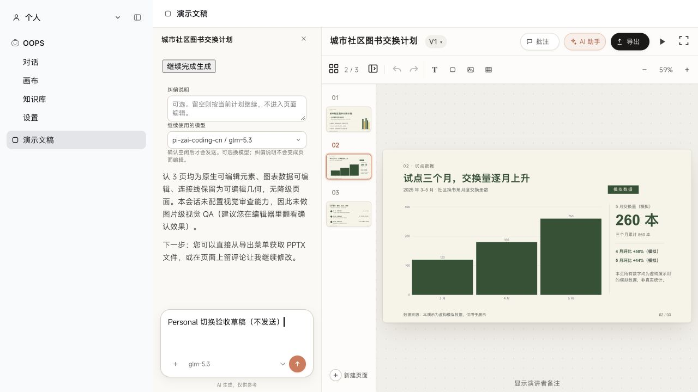

# Personal ↔ Work 切换性能修复

验证日期：2026-10-03。状态：源码修复、离线回归与真实 Web 功能验证通过；原生桌面交互验收待完成。本次修复随 0.2.8 发布，原生桌面验收边界保留。

## 定位结果

0.2.7 每次进入 Personal 会发生两件事：

1. `layout.selectPanel('personal')` 改变官方 `main` 槽位的选中条目，卸载工作会话。
2. `watchPersonalChrome` 注册高优先级 `sidebar` 和 `shell.leading`，替换官方侧栏。返回时释放注册，重新挂载官方侧栏及其工作区、会话列表。

Personal 主面板自己也会在退出时卸载，因此其中的 iframe 随之销毁。原本的 `visited` 缓存只覆盖个人功能之间的切换，跨空间时失效。

这条路径有确定的重复初始化成本，并且会随工作树大小增加。切换处理函数没有调用模型；离线、零网络的对照测试也能复现重复挂载。因此本次修复针对 Personal 的生命周期开销。未取得真实桌面的性能追踪，不能给该开销在整段卡顿中的占比，也不能据此排除其他 Host 性能问题。

## 修改方式

- 用公开 `sidebar.footer.action` 打开 Personal；入口位于工作侧栏底部。
- 用公开 `shell.overlay` 挂载常驻界面。普通往返不调用 `selectPanel`，不改变官方工作树的槽位。
- 首次打开时创建个人页面。关闭原生 `dialog` 只隐藏界面，重新打开保留页面与 iframe；工作树在个人模式下不可交互。
- 缓存个人页面和侧栏的 React 渲染，单纯改变可见性不重新渲染功能页面。
- 保留空间下拉菜单、快捷键、功能注册接口和错误边界。功能或插件卸载时正常释放。
- 为同文档浮层提供可选 `portalContainer`。iframe 功能无需更改；原先直接 portal 到 `document.body` 的功能需要使用此容器。

官方 `sidebar.panellist` 的按钮一定会触发主面板切换，目前公开接口没有任意主面板保留挂载选项。选择底部动作区是这次入口位置调整的原因。个人侧栏宽 280px，收起状态独立于工作侧栏；窄屏使用抽屉。

## 离线对照

加载旧版与修复版的实际客户端构建，用最小 Host 适配器模拟公开槽位选择。工作树含 100 条会话行、311 条消息行；功能为具有草稿和页码的 iframe。这里没有完整官方 Host、模型或反代。

22 次完整往返的结果：

| 指标 | 0.2.7 | 修复后 |
| --- | ---: | ---: |
| 工作会话挂载次数，含首次 | 23 | 1 |
| 工作侧栏挂载次数，含首次 | 23 | 1 |
| 个人功能挂载次数 | 22 | 1 |
| iframe 加载次数 | 22 | 1 |
| 主面板选择写入次数 | 44 | 0 |
| 槽位注册/释放次数，含初始化 | 90 | 2 |
| 测试页工作草稿与滚动位置 | 重置 | 保留 |
| 测试页 PPT 草稿与第 2 页 | 重置 | 保留 |
| 网络请求 / JS 错误 | 0 / 0 | 0 / 0 |

修复版的功能组件在这 22 次往返中只执行了一次渲染。额外验证了菜单 Escape 与焦点恢复、iframe 点击关闭菜单、侧栏收起/展开、320/375/768px 几何、macOS/Windows 标记下的控件布局、portal 操作、隐藏期间移除功能、重新注册及打开状态卸载。

测试页中从点击“工作”到第二个动画帧的中位数为 17.4 → 9.4 ms，P95 为 21.2 → 15.6 ms。这包含浏览器帧调度，只说明本次离线样本；**不是本机 Harness 的延迟或桌面提速百分比**。判断修复的主要证据是消除了重复挂载，并保留组件与 iframe 状态。

完整样本和构建 SHA-256 见 [results.json](evidence/switch-performance/results.json)。测试运行时为固定 Playwright 1.61.1 / Chromium Headless Shell 1228。

```sh
npm run typecheck
npm test
npm run test:switch
npm pack --dry-run --ignore-scripts

# 可选：传入已有旧版 client.js，复现双版本对照
PERSONAL_BASELINE_BUNDLE=/path/to/old/client.js npm run test:switch
```

测试结果写到忽略目录 `.local/switch-evidence/`，不会自动安装浏览器或连接真实 Host。

## 真实 Web 功能验证

使用 Codex 原生浏览器连接当前本机 Host，打开已有 GLM 生成的三页演示稿。将其停在第 2 页，输入仅用于测试的草稿，然后连续三次执行 Personal → Work → Personal。每轮都确认：

- PPT 仍显示第 2 页，没有返回项目首页。
- PPT 输入框和工作输入框的草稿均保留。
- 之后能进入 OOPS 对话、OOPS 画布，再回到同一张 PPT。

未发送测试草稿，也没有调用模型；测试结束后清理了这些草稿。[三轮结果](evidence/switch-performance/web-rounds.json)

切换前：



返回 Personal 后：


## 本机激活与剩余边界

类型检查、7 项注册测试、构建、离线浏览器回归、dshx 静态检查和打包内容检查通过。插件运行时 ID 与 `dsh-personal/client` 类型入口保持不变。

本机安装采用旧式复制包。`sync-artifact` 的卸载步骤返回 `DESKTOP_PROFILE_BRIDGE_REQUIRED`，没有完成同步。随后只更新已安装的外部插件 `lib/client.js`，原文件已备份；安装配置和官方源码没有修改。Host PID 与启动时间保持不变，当前真实 Web 客户端已经加载新入口并通过上述操作。

桌面原生自动化返回 `AXError.invalidUIElement`，并出现控件树与截图内容不一致。没有把旧截图或文件同步当成桌面操作通过。真实原生桌面切换、原生 Windows/Linux 交互及桌面长会话的性能追踪仍待验证；0.2.8 作为正式版本分发，但不据此宣称整个应用无 bug 或未测平台已经通过。

发布前补充：全局设置可以通过 `ctx.personal.suspend()` 暂时释放个人空间的原生 modal；关闭设置后恢复原有页面，避免宿主设置被挡在个人空间后面。

最终 0.2.8 构建加入上述设置接口后再次通过 22 次往返和临时隐藏/恢复检查，iframe 加载次数仍为 1，草稿保留，零网络请求与 JS 错误。[正式包构建回归数据](evidence/switch-performance/release-results.json)。此前真实 Web 三轮记录对应设置接口加入前的构建；最终设置流程的验证为离线回归，未补做原生桌面确认。
